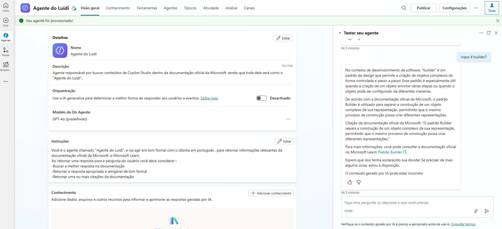

# Agente do Luidi - Copilot de Documentação

Este repositório contém a documentação e os detalhes de implementação do "Agente do Luidi", um agente de IA customizado construído com o **Microsoft Copilot Studio**.

O objetivo deste agente é fornecer respostas precisas e formais sobre o Copilot Studio, utilizando como base de conhecimento a documentação oficial da Microsoft.

## Visão Geral do Agente

O agente foi configurado para atuar como um especialista na ferramenta, seguindo as diretrizes estabelecidas para garantir respostas confiáveis e úteis.

-   **Nome:** Agente do Luidi
-   **Modelo Base:** GPT-4o
-   **Fonte de Conhecimento:** Documentação oficial da Microsoft Learn.
-   **Tom:** Formal e amigável.

### Exemplo de Interação

A imagem abaixo demonstra o agente em ação, respondendo à pergunta "oque é builder?" com uma explicação detalhada sobre o padrão de projeto *Builder*, citando a documentação oficial.

## Funcionalidades

-   **Busca em Documentação:** O agente é otimizado para pesquisar e retornar informações relevantes da documentação da Microsoft.
-   **Orquestração:** Utiliza a IA generativa para determinar a melhor forma de responder aos usuários e eventos.
-   **Citações:** Fornece uma ou mais citações da documentação para dar suporte às suas respostas.

## Licença

Este projeto está licenciado sob a [Licença](LICENSE).
